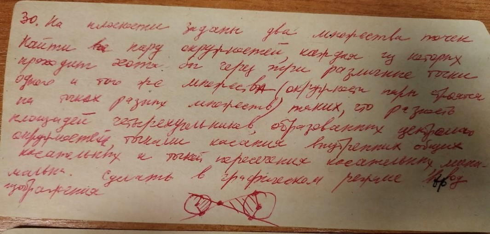

# Комплексная геометрическая задача с использованием графических средств для представления результата

На плоскости заданы два множества точек. Найти пару окружностей, каждая из которых проходит хотя бы через три
различные точки одного и того же множества (окружности строятся на точках разных множеств) таких, что разность
площадей четырехугольников, образованных центрами окружностей, точками касания внутренних общих касательных
и точкой пересечения касательных минимальна. Сделать в графическом режиме вывод изображения.

